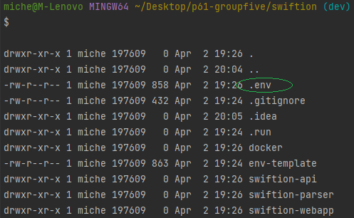
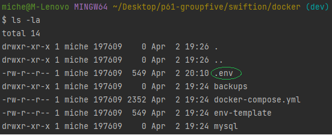

# Project Swiftion
Swiftion is a project developed by a group of students from NHL Stenden University.
This web application is designed to work with MT940 files, commonly used in the banking industry for financial transactions. 
The project's name is inspired by the SWIFT network, a global provider of secure financial messaging services. 
Swiftion aims to provide an efficient and user-friendly solution for managing financial transactions through a web-based interface.

For more detailed information about the project, please take a look at the documentation.

## Getting started
Swiftion is intended to run in a containerized Docker environment. To accomplish this, a `docker-compose.yml` 
file was created and can be found in the docker folder. Nonetheless, certain prerequisites must be met before the application can run successfully.

### docker-compose
The `docker-compose.yml` file will create a docker network in which multiple containers reside. 
The containers that will start from the `docker-compose.yml` are:

- Swiftion API
- Swiftion Parser
- Swiftion Webapp
- MongoDB (NoSQL)
- MySQL
- Mongo-express (optional)
- Phpmyadmin (optional)

When the default settings of the `docker-compose.yml` file are used, only the webapp port (80) will be published.
All other communication that is done by the containers to and from other containers is solely done within the Docker network, which isn't directly
accessible from the host system.

#### .env
In order to start the Docker environment, **2** `.env` files need to be set. Under the Swiftion folder, a `env-template` file
can be found with remaining details that need to be filled in for everything except the container ID (the container ID is for backup purposes).
Create a .env file in the same directory as the `env-template` folder and set in the correct configuration details.

Once the `.env` file in the Swiftion folder is set, one remaining `.env` file needs to be set with the correct details. 
Again, create a .env file from the template that can be found in the `docker` folder This `.env` file can be found in the `docker` folder, 
next to the `docker-compose.yml` file.

From this point, it is possible to start the docker containers through the `docker-compose.yml` file.

#### Default credentials webapp
The default credentials for logging in as a `penningmeester` on the Swiftion webapp are : \
\
`dev@quintor`:`Quintor02!`

### Authors
@SteffanvanderWerf02, @NHL-Michel, @Moniquesbg, @jesseoost 
